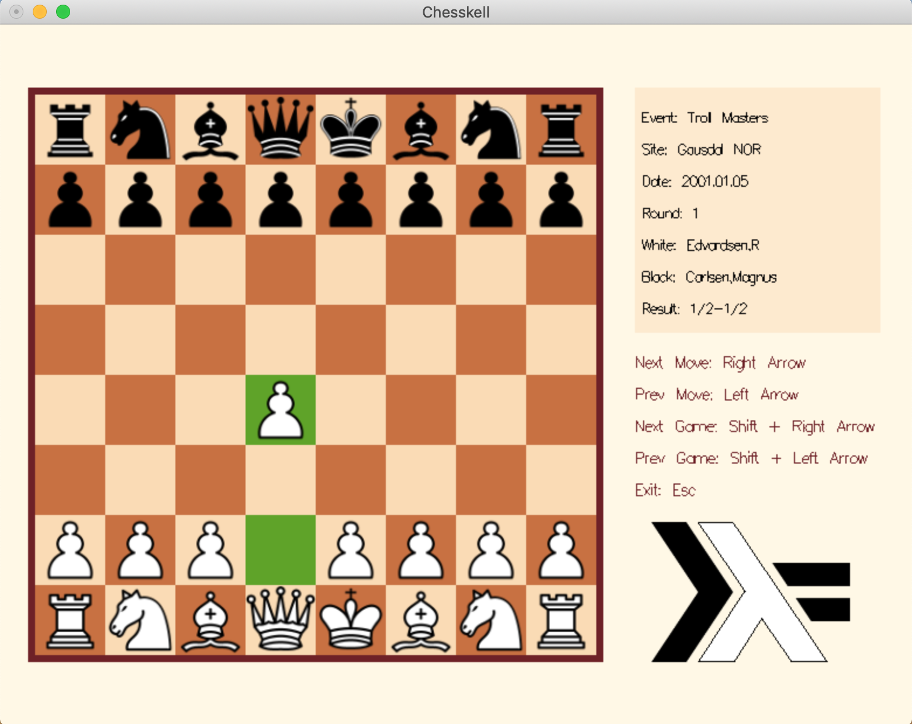

# Chesskell

Visualizes chess games in [PGN](https://en.wikipedia.org/wiki/Portable_Game_Notation) format.



## Installation

```sh
git clone https://github.com/teremax/Chesskell.git
cd Chesskell
stack build
stack exec Chesskell-exe <.pgn filepath>
```

Make sure you have [stack](https://docs.haskellstack.org) installed.

## Usage

* Download `.pgn` file of games which you want to visualize.
* Run the project by passing the path to the games file.
* Use arrow keys and shift key to switch between chess moves and games.

## Author

Maxim Tereshchuk - m.a.tereshchuk@gmail.com

## License

This project is licensed under the BSD 3-Clause License - see the [LICENSE.md](LICENSE.md) file for details.

## Acknowledgements
* [Haskell ITMO course at CTD](https://github.com/jagajaga/FP-Course-ITMO)
* [Haskell Stepik course](https://stepik.org/course/75/promo)
* [Chess.com analysis board](https://www.chess.com/analysis)
